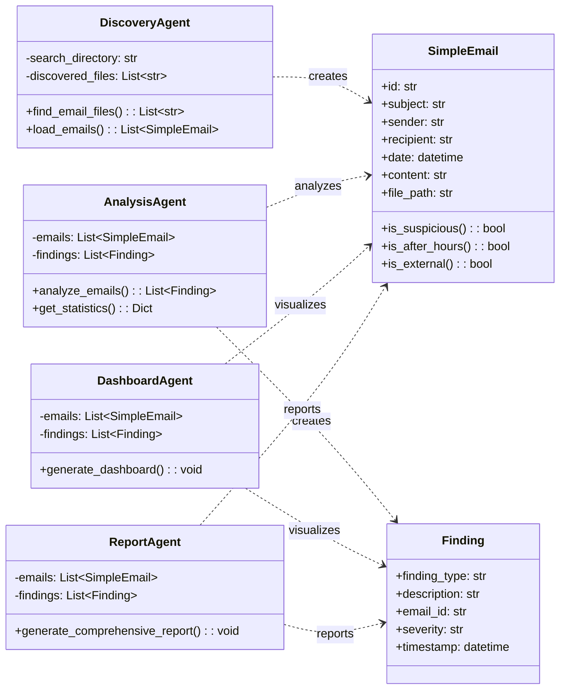

# Class Diagram

```mermaid
classDiagram
    direction LR

    class DiscoveryAgent {
        -search_directory: str
        -discovered_files: List~str~
        +find_email_files(): List~str~
        +load_emails(): List~SimpleEmail~
    }

    class DashboardAgent {
        -emails: List~SimpleEmail~
        -findings: List~Finding~
        +generate_dashboard(): void
    }

    class AnalysisAgent {
        -emails: List~SimpleEmail~
        -findings: List~Finding~
        +analyze_emails(): List~Finding~
        +get_statistics(): Dict
    }

    class ReportAgent {
        -emails: List~SimpleEmail~
        -findings: List~Finding~
        +generate_comprehensive_report(): void
    }

    class SimpleEmail {
        +id: str
        +subject: str
        +sender: str
        +recipient: str
        +date: datetime
        +content: str
        +file_path: str
        +is_suspicious(): bool
        +is_after_hours(): bool
        +is_external(): bool
    }

    class Finding {
        +finding_type: str
        +description: str
        +email_id: str
        +severity: str
        +timestamp: datetime
    }

    DiscoveryAgent ..> SimpleEmail : creates
    AnalysisAgent ..> SimpleEmail : analyzes
    AnalysisAgent ..> Finding : creates
    DashboardAgent ..> SimpleEmail : visualizes
    DashboardAgent ..> Finding : visualizes
    ReportAgent ..> SimpleEmail : reports
    ReportAgent ..> Finding : reports

```
